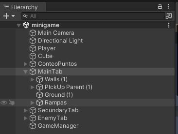
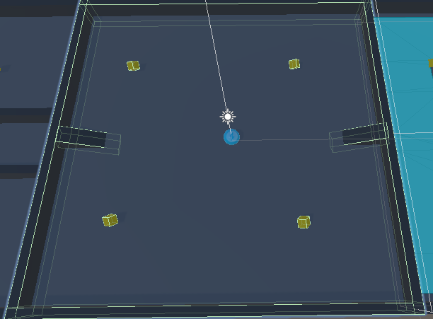
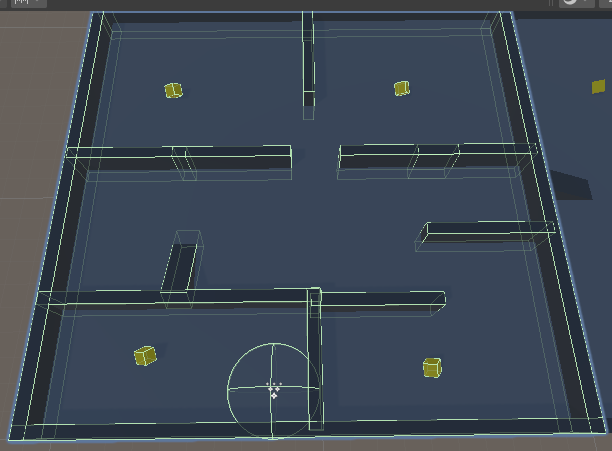
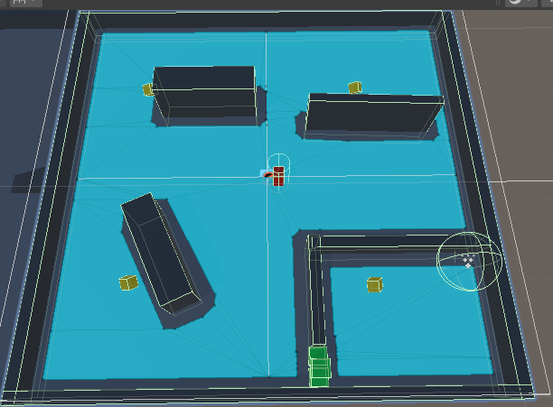

# A mayores del tutorial

Hice una organización con objetos vacios con un tablero principal, que tiene paredes, pickups y rampas para acceder a otros "tableros".

Luego hice un "tablero" que es una copia del tablero principal pero con algunas paredes para ser un micro-laberinto con una sala cerrada para pillar el último pickup de ese tablero, para poder volver cree un portal con el sistema de particulas y un tag personalizado para volver al player a la posición inicial.

Con esto aprendi el uso de los tags en Unity, modificar la posición de las cosas, un poco del sistema de particulas y como funcionan las rampas.

Finalmente, hice un tablero más, nuevamente copiando el tablero principal pero este tiene unas paredes, un enemigo que te persigue y algunos objetos que se pueden mover.

Con esto aprendi como usar el Mesh Nav para que un enemigo te persiga por un terreno limitado y como funcionan los objetos dinámicos.

Luego para que el juego sea más divertido le añadi un control de tiempo, un game Manager que guarde en una variable estatica el valor del mejor tiempo en esa sesión y que permita tanto pausar el tiempo del juego como reiniciar la escena para hacer otra ronda.

Con esto aprendi sobre el tiempo interno de Unity, como interactuan los datos estaticos con un reinicio de escena y como puedes detectar más inputs del teclado que no sean solo los de movimiento.
